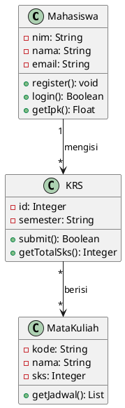
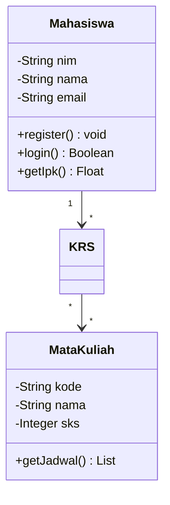
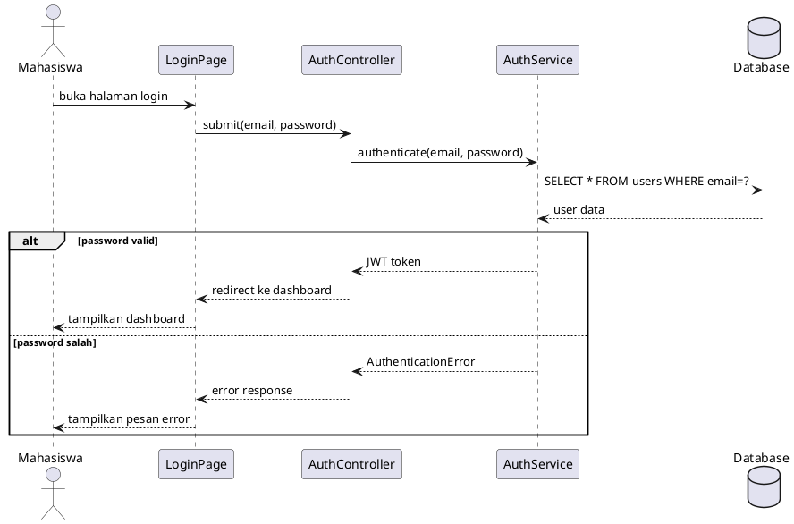

# Minggu 6: Desain Perangkat Lunak — UML dan Database Design

## Informasi Modul

| Komponen | Detail |
|----------|--------|
| **Mata Kuliah** | Rekayasa Perangkat Lunak |
| **Kode** | IF2205 |
| **Minggu** | 6 dari 16 |
| **Topik** | UML Diagrams (5 tipe), Database Design (ERD, Normalisasi), REST API Design |
| **Dosen** | Tri Aji Nugroho, S.T., M.T. |
| **Program Studi** | Informatika, Universitas Al Azhar Indonesia |
| **Semester** | Genap 2025/2026 |
| **Bahasa Pemrograman** | Python 3.x + JavaScript |
| **CPMK** | CPMK-3 |
| **Sub-CPMK** | 3.3 (UML structural & behavioral), 3.4 (Database design & REST API) |
| **Durasi** | 150 menit (3 x 50 menit) |
| **Metode** | Ceramah, live modeling, praktik desain |

## Tujuan Pembelajaran

Setelah mengikuti perkuliahan minggu ini, mahasiswa mampu:

1. **Membuat** 5 jenis UML diagram (Class, Sequence, Activity, State, Component) menggunakan PlantUML/Mermaid (C3)
2. **Merancang** Entity-Relationship Diagram (ERD) dan menerapkan normalisasi hingga 3NF (C3)
3. **Mendesain** RESTful API endpoint lengkap dengan HTTP methods dan status codes (C3)
4. **Mengimplementasikan** database model menggunakan SQLAlchemy dan Flask API (C3)

---

## Materi Pembelajaran

### 6.1 UML (Unified Modeling Language) — Bahasa Visual untuk Desain

#### 6.1.1 Apa Itu UML?

UML (*Unified Modeling Language*) adalah bahasa standar untuk **memodelkan** dan **memvisualisasikan** sistem software. UML bukan bahasa pemrograman — UML adalah notasi visual yang membantu komunikasi antara developer, analis, dan stakeholder.

```
┌─────────────────────────────────────────────────────────────────┐
│                    UML DIAGRAM TAXONOMY                           │
│                                                                  │
│  ┌───────────────────────────────────────────────────────────┐  │
│  │                    UML DIAGRAMS                            │  │
│  └───────────────────────┬───────────────────────────────────┘  │
│                          │                                       │
│          ┌───────────────┴───────────────┐                      │
│          │                               │                      │
│  ┌───────┴──────┐               ┌───────┴──────┐              │
│  │  STRUCTURAL  │               │  BEHAVIORAL  │              │
│  │  (statis)    │               │  (dinamis)   │              │
│  └──────┬───────┘               └──────┬───────┘              │
│         │                              │                        │
│  - Class Diagram *              - Sequence Diagram *           │
│  - Component Diagram *          - Activity Diagram *           │
│  - Deployment Diagram           - State Diagram *              │
│  - Package Diagram              - Use Case Diagram (W4)        │
│  - Object Diagram               - Communication Diagram        │
│                                                                  │
│  * = yang dipelajari di minggu ini                              │
└─────────────────────────────────────────────────────────────────┘
```

#### 6.1.2 Class Diagram — Struktur Statis Sistem

Class Diagram menggambarkan **class**, **atribut**, **method**, dan **relasi** antar class.

```
┌─────────────────────────────────────────────────────────────────┐
│        CLASS DIAGRAM — Sistem Akademik UAI                       │
│                                                                  │
│  ┌──────────────────┐       1     *  ┌──────────────────┐      │
│  │    Mahasiswa      │──────────────▶│       KRS         │      │
│  ├──────────────────┤               ├──────────────────┤      │
│  │ - nim: str        │               │ - id: int        │      │
│  │ - nama: str       │               │ - semester: str  │      │
│  │ - email: str      │               │ - status: str    │      │
│  │ - angkatan: int   │               ├──────────────────┤      │
│  ├──────────────────┤               │ + submit()       │      │
│  │ + register()      │               │ + approve()      │      │
│  │ + login()         │               │ + get_total_sks()│      │
│  │ + get_ipk()       │               └────────┬─────────┘      │
│  └──────────────────┘                         │ *               │
│         △                                     │                  │
│         │ extends                        ┌────┴─────────────┐  │
│  ┌──────┴───────────┐                   │   DetailKRS      │  │
│  │  MahasiswaAktif   │                   ├──────────────────┤  │
│  ├──────────────────┤                   │ - mata_kuliah_id │  │
│  │ - status: str     │                   │ - kelas: str     │  │
│  ├──────────────────┤                   └────────┬─────────┘  │
│  │ + isi_krs()       │                            │ *           │
│  │ + bayar_spp()     │                            │             │
│  └──────────────────┘                    ┌───────┴──────────┐  │
│                                          │   MataKuliah      │  │
│  ┌──────────────────┐                   ├──────────────────┤  │
│  │      Dosen        │ 1            *   │ - kode: str      │  │
│  ├──────────────────┤──────────────────▶│ - nama: str      │  │
│  │ - nip: str        │ mengajar          │ - sks: int       │  │
│  │ - nama: str       │                   │ - semester: int  │  │
│  │ - keahlian: str   │                   ├──────────────────┤  │
│  ├──────────────────┤                   │ + get_jadwal()   │  │
│  │ + input_nilai()   │                   │ + get_prasyarat()│  │
│  │ + buat_jadwal()   │                   └──────────────────┘  │
│  └──────────────────┘                                           │
│                                                                  │
│  Relasi:                                                        │
│  ─── Association    ◇── Aggregation                             │
│  ◆── Composition    △── Inheritance    - -▶ Dependency          │
└─────────────────────────────────────────────────────────────────┘
```

**Relasi dalam Class Diagram:**

| Relasi | Simbol | Deskripsi | Contoh |
|--------|--------|-----------|--------|
| Association | ─── | Hubungan umum antar class | Mahasiswa meminjam Buku |
| Aggregation | ◇─── | "Has-a" (bagian bisa hidup tanpa keseluruhan) | Universitas has Dosen |
| Composition | ◆─── | "Has-a" (bagian tidak bisa tanpa keseluruhan) | Order has OrderItem |
| Inheritance | △─── | "Is-a" (pewarisan) | Admin extends User |
| Dependency | - - -▶ | Ketergantungan sementara | Controller uses Service |

**PlantUML Syntax:**



**Mermaid Syntax (untuk GitHub):**



#### 6.1.3 Sequence Diagram — Interaksi Antar Objek

Sequence Diagram menggambarkan **urutan interaksi** antar objek sepanjang waktu.

```
┌─────────────────────────────────────────────────────────────────┐
│   SEQUENCE DIAGRAM — Proses Login Sistem Akademik UAI            │
│                                                                  │
│  Mahasiswa      LoginPage      AuthController    AuthService    DB│
│     │               │              │                │           │ │
│     │── buka login ─▶│              │                │           │ │
│     │               │── submit ───▶│                │           │ │
│     │               │              │── validate ───▶│           │ │
│     │               │              │                │── query ─▶│ │
│     │               │              │                │◀── user ──│ │
│     │               │              │                │           │ │
│     │               │              │    ┌───────────┤           │ │
│     │               │              │    │ verify    │           │ │
│     │               │              │    │ password  │           │ │
│     │               │              │    └───────────┤           │ │
│     │               │              │                │           │ │
│     │               │              │◀─ JWT token ───│           │ │
│     │               │◀── redirect ─│                │           │ │
│     │◀─ dashboard ──│              │                │           │ │
│     │               │              │                │           │ │
│                                                                  │
│  alt [password salah]                                           │
│     │               │              │◀─── error ────│           │ │
│     │               │◀── error ────│                │           │ │
│     │◀─ error msg ──│              │                │           │ │
│  end                                                             │
└─────────────────────────────────────────────────────────────────┘
```



#### 6.1.4 Activity Diagram — Alur Proses (Flowchart UML)

```
┌─────────────────────────────────────────────────────────────────┐
│   ACTIVITY DIAGRAM — Proses Pengisian KRS Online UAI             │
│                                                                  │
│  (●) Start                                                      │
│   │                                                              │
│   ▼                                                              │
│  [Login ke Sistem Akademik]                                     │
│   │                                                              │
│   ▼                                                              │
│  ◇ Sudah bayar SPP?                                             │
│  / \                                                             │
│ Ya   Tidak                                                       │
│ │      │                                                         │
│ │      ▼                                                         │
│ │   [Tampilkan pesan: "Bayar SPP terlebih dahulu"]              │
│ │      │                                                         │
│ │      ▼                                                         │
│ │   (●) End                                                     │
│ │                                                                │
│ ▼                                                                │
│ [Lihat daftar mata kuliah yang tersedia]                        │
│  │                                                               │
│  ▼                                                               │
│ [Pilih mata kuliah + kelas]                                     │
│  │                                                               │
│  ▼                                                               │
│  ◇ Total SKS <= 24?                                             │
│  / \                                                             │
│ Ya   Tidak                                                       │
│ │      │                                                         │
│ │      ▼                                                         │
│ │   [Tampilkan pesan: "Melebihi batas SKS"]                    │
│ │      │                                                         │
│ │      └────▶ [Kembali ke pilih MK]                             │
│ │                                                                │
│ ▼                                                                │
│ ◇ Ada bentrok jadwal?                                           │
│  / \                                                             │
│ Tidak  Ya                                                        │
│ │      │                                                         │
│ │      ▼                                                         │
│ │   [Tampilkan pesan: "Jadwal bentrok!"]                        │
│ │      │                                                         │
│ │      └────▶ [Kembali ke pilih MK]                             │
│ │                                                                │
│ ▼                                                                │
│ [Submit KRS]                                                     │
│  │                                                               │
│  ▼                                                               │
│ [Dosen PA mereview]                                              │
│  │                                                               │
│  ◇ Disetujui?                                                   │
│  / \                                                             │
│ Ya   Tidak                                                       │
│ │      │                                                         │
│ │      ▼                                                         │
│ │   [Kembali ke mahasiswa + catatan revisi]                     │
│ │                                                                │
│ ▼                                                                │
│ [KRS difinalisasi, jadwal terkunci]                             │
│  │                                                               │
│  ▼                                                               │
│ (●) End                                                         │
└─────────────────────────────────────────────────────────────────┘
```

#### 6.1.5 State Diagram — Siklus Hidup Objek

```
┌─────────────────────────────────────────────────────────────────┐
│   STATE DIAGRAM — Status Peminjaman Buku Perpustakaan            │
│                                                                  │
│  (●)                                                            │
│   │                                                              │
│   │ mahasiswa klik "Pinjam"                                     │
│   ▼                                                              │
│  ┌────────────┐   pustakawan    ┌────────────┐                 │
│  │  REQUESTED  │───approves────▶│  BORROWED   │                 │
│  │             │                │             │                 │
│  └──────┬─────┘                └──────┬─────┘                 │
│         │                             │                          │
│    mahasiswa                    mahasiswa                        │
│    cancel                       kembalikan                      │
│         │                             │                          │
│         ▼                             ▼                          │
│  ┌────────────┐                ┌────────────┐                  │
│  │  CANCELLED  │                │  RETURNED   │                  │
│  └────────────┘                └──────┬─────┘                  │
│                                       │                          │
│                                  ◇ Terlambat?                   │
│                                 / \                              │
│                               Ya   Tidak                         │
│                               │      │                           │
│                               ▼      ▼                           │
│                        ┌──────────┐  ┌────────────┐            │
│                        │  OVERDUE  │  │  COMPLETED  │            │
│                        │(ada denda)│  │             │            │
│                        └─────┬────┘  └────────────┘            │
│                              │                                   │
│                         bayar denda                              │
│                              │                                   │
│                              ▼                                   │
│                        ┌────────────┐                           │
│                        │  COMPLETED  │                           │
│                        └────────────┘                           │
└─────────────────────────────────────────────────────────────────┘
```

```python
# Implementasi State Pattern untuk status peminjaman

class PeminjamanState:
    """Base state untuk peminjaman buku."""
    
    VALID_TRANSITIONS = {
        "REQUESTED": ["BORROWED", "CANCELLED"],
        "BORROWED": ["RETURNED"],
        "RETURNED": ["COMPLETED", "OVERDUE"],
        "OVERDUE": ["COMPLETED"],
        "CANCELLED": [],
        "COMPLETED": [],
    }
    
    def __init__(self, current="REQUESTED"):
        self.current = current
        self.history = [current]
    
    def transition(self, new_state: str) -> bool:
        """Transisi ke state baru jika valid."""
        valid = self.VALID_TRANSITIONS.get(self.current, [])
        if new_state in valid:
            old = self.current
            self.current = new_state
            self.history.append(new_state)
            print(f"  Transisi: {old} -> {new_state}")
            return True
        else:
            print(f"  GAGAL: Tidak bisa dari {self.current} ke {new_state}")
            return False

# Penggunaan
peminjaman = PeminjamanState()
peminjaman.transition("BORROWED")    # Transisi: REQUESTED -> BORROWED
peminjaman.transition("RETURNED")    # Transisi: BORROWED -> RETURNED
peminjaman.transition("COMPLETED")   # Transisi: RETURNED -> COMPLETED
peminjaman.transition("BORROWED")    # GAGAL: Tidak bisa dari COMPLETED ke BORROWED
print(f"History: {peminjaman.history}")
# History: ['REQUESTED', 'BORROWED', 'RETURNED', 'COMPLETED']
```

#### 6.1.6 Component Diagram — Arsitektur Tingkat Tinggi

```
┌─────────────────────────────────────────────────────────────────┐
│   COMPONENT DIAGRAM — Sistem Perpustakaan Digital UAI            │
│                                                                  │
│  ┌─────────────────────────────────────────────────────────┐   │
│  │                    WEB APPLICATION                       │   │
│  │                                                         │   │
│  │  ┌────────────┐  ┌────────────┐  ┌────────────┐       │   │
│  │  │    Auth    │  │    Book    │  │    Loan    │       │   │
│  │  │  Component │  │  Component │  │  Component │       │   │
│  │  │            │  │            │  │            │       │   │
│  │  │ - login    │  │ - search   │  │ - borrow   │       │   │
│  │  │ - register │  │ - catalog  │  │ - return   │       │   │
│  │  │ - JWT      │  │ - detail   │  │ - history  │       │   │
│  │  └─────┬──────┘  └─────┬──────┘  └─────┬──────┘       │   │
│  │        │               │               │               │   │
│  │        └───────────────┼───────────────┘               │   │
│  │                        │                                │   │
│  │                  ┌─────┴──────┐                         │   │
│  │                  │  Database  │                         │   │
│  │                  │  (SQLite)  │                         │   │
│  │                  └────────────┘                         │   │
│  └─────────────────────────────────────────────────────────┘   │
│                        │                                        │
│                   ┌────┴────┐                                  │
│                   │  Email  │  (external service)               │
│                   │ Service │                                  │
│                   └─────────┘                                  │
└─────────────────────────────────────────────────────────────────┘
```

### 6.2 Database Design — ERD dan Normalisasi

#### 6.2.1 Entity-Relationship Diagram (ERD)

ERD menggambarkan **entitas**, **atribut**, dan **relasi** dalam database.

```
┌─────────────────────────────────────────────────────────────────┐
│   ERD — Sistem Perpustakaan UAI                                  │
│                                                                  │
│  ┌──────────┐     1:N     ┌──────────────┐     N:1     ┌──────┐│
│  │   User   │────────────▶│  Peminjaman   │◀───────────│ Buku ││
│  │          │             │              │             │      ││
│  │ PK: id   │             │ PK: id       │             │PK: id││
│  │ nama     │             │ FK: user_id  │             │judul ││
│  │ email    │             │ FK: buku_id  │             │penulis│
│  │ password │             │ tgl_pinjam   │             │isbn  ││
│  │ role     │             │ tgl_kembali  │             │stok  ││
│  └──────────┘             │ status       │             │tahun ││
│                           │ denda        │             └──────┘│
│                           └──────────────┘                     │
│                                                                  │
│  ┌──────────┐     1:N     ┌──────────────┐                     │
│  │ Kategori │────────────▶│  Buku        │                     │
│  │          │             │ FK: kategori │                     │
│  │ PK: id   │             │    _id       │                     │
│  │ nama     │             └──────────────┘                     │
│  └──────────┘                                                   │
│                                                                  │
│  Kardinalitas:                                                  │
│  1:1 = Satu ke satu (User - Profile)                           │
│  1:N = Satu ke banyak (User - Peminjaman)                      │
│  N:M = Banyak ke banyak (perlu tabel junction)                 │
└─────────────────────────────────────────────────────────────────┘
```

#### 6.2.2 Normalisasi Database (1NF - 3NF)

Normalisasi menghilangkan **redundansi data** dan **anomali** (insert, update, delete anomaly).

**Contoh: Data Peminjaman (Belum Dinormalisasi)**

| peminjaman_id | nama_mhs | nim | judul_buku | penulis | tgl_pinjam |
|--------------|----------|-----|------------|---------|-----------|
| 1 | Ahmad Fauzi | 2210001 | Clean Code, Refactoring | Martin, Fowler | 2026-04-01 |
| 2 | Siti Rahma | 2210002 | Clean Code | Martin | 2026-04-02 |

**Masalah:** Kolom judul_buku dan penulis berisi multiple values (melanggar 1NF).

**1NF — Setiap kolom bernilai atomik (tunggal):**

| peminjaman_id | nama_mhs | nim | judul_buku | penulis | tgl_pinjam |
|--------------|----------|-----|------------|---------|-----------|
| 1 | Ahmad Fauzi | 2210001 | Clean Code | Martin | 2026-04-01 |
| 1 | Ahmad Fauzi | 2210001 | Refactoring | Fowler | 2026-04-01 |
| 2 | Siti Rahma | 2210002 | Clean Code | Martin | 2026-04-02 |

**Masalah 1NF:** nama_mhs bergantung hanya pada nim, bukan pada seluruh PK.

**2NF — Setiap non-key bergantung pada seluruh primary key:**

Tabel `mahasiswa`:

| nim (PK) | nama_mhs |
|----------|----------|
| 2210001 | Ahmad Fauzi |
| 2210002 | Siti Rahma |

Tabel `buku`:

| buku_id (PK) | judul | penulis |
|--------------|-------|---------|
| 1 | Clean Code | Martin |
| 2 | Refactoring | Fowler |

Tabel `peminjaman`:

| id (PK) | nim (FK) | buku_id (FK) | tgl_pinjam |
|---------|----------|-------------|-----------|
| 1 | 2210001 | 1 | 2026-04-01 |
| 2 | 2210001 | 2 | 2026-04-01 |
| 3 | 2210002 | 1 | 2026-04-02 |

**3NF — Tidak ada transitive dependency:**

Jika ada kolom `nama_jurusan` yang bergantung pada `kode_jurusan` (bukan pada PK), maka perlu dipecah ke tabel terpisah.

```
┌─────────────────────────────────────────────────────────────────┐
│              RINGKASAN NORMALISASI                                │
│                                                                  │
│  UNF    →    1NF    →    2NF    →    3NF                        │
│                                                                  │
│  Kolom       Setiap      Non-key      Tidak ada                 │
│  multi-      kolom       bergantung   transitive                │
│  value       atomik      pada SEMUA   dependency                │
│                          primary key                             │
│                                                                  │
│  "Semua data  "Satu      "Bergantung  "Bergantung              │
│   di satu      nilai      pada key,   pada key,                │
│   tempat"      per cell"  seluruh key" HANYA key"              │
└─────────────────────────────────────────────────────────────────┘
```

#### 6.2.3 Implementasi Database dengan SQLAlchemy

```python
# Model database menggunakan Flask-SQLAlchemy
# File: models.py

from flask_sqlalchemy import SQLAlchemy
from datetime import datetime, timedelta

db = SQLAlchemy()

class User(db.Model):
    """Tabel user (mahasiswa dan pustakawan)."""
    __tablename__ = 'users'
    
    id = db.Column(db.Integer, primary_key=True)
    nama = db.Column(db.String(100), nullable=False)
    email = db.Column(db.String(120), unique=True, nullable=False)
    password_hash = db.Column(db.String(256), nullable=False)
    role = db.Column(db.String(20), default='mahasiswa')  # mahasiswa/pustakawan
    created_at = db.Column(db.DateTime, default=datetime.utcnow)
    
    # Relasi: satu user punya banyak peminjaman
    peminjaman = db.relationship('Peminjaman', backref='user', lazy=True)
    
    def __repr__(self):
        return f'<User {self.nama}>'


class Kategori(db.Model):
    """Tabel kategori buku."""
    __tablename__ = 'kategori'
    
    id = db.Column(db.Integer, primary_key=True)
    nama = db.Column(db.String(50), unique=True, nullable=False)
    
    buku = db.relationship('Buku', backref='kategori', lazy=True)


class Buku(db.Model):
    """Tabel buku perpustakaan."""
    __tablename__ = 'buku'
    
    id = db.Column(db.Integer, primary_key=True)
    judul = db.Column(db.String(200), nullable=False)
    penulis = db.Column(db.String(100), nullable=False)
    isbn = db.Column(db.String(13), unique=True)
    stok = db.Column(db.Integer, default=0)
    tahun = db.Column(db.Integer)
    kategori_id = db.Column(db.Integer, db.ForeignKey('kategori.id'))
    
    peminjaman = db.relationship('Peminjaman', backref='buku', lazy=True)
    
    def is_available(self):
        """Cek apakah buku masih tersedia."""
        return self.stok > 0


class Peminjaman(db.Model):
    """Tabel peminjaman buku."""
    __tablename__ = 'peminjaman'
    
    id = db.Column(db.Integer, primary_key=True)
    user_id = db.Column(db.Integer, db.ForeignKey('users.id'), nullable=False)
    buku_id = db.Column(db.Integer, db.ForeignKey('buku.id'), nullable=False)
    tanggal_pinjam = db.Column(db.Date, default=datetime.utcnow)
    tanggal_kembali = db.Column(db.Date)
    tanggal_dikembalikan = db.Column(db.Date)  # Actual return date
    status = db.Column(db.String(20), default='dipinjam')
    denda = db.Column(db.Integer, default=0)
    
    def hitung_denda(self):
        """Hitung denda keterlambatan (Rp 1.000/hari)."""
        if self.tanggal_dikembalikan and self.tanggal_kembali:
            selisih = (self.tanggal_dikembalikan - self.tanggal_kembali).days
            if selisih > 0:
                self.denda = selisih * 1000
        return self.denda
```

### 6.3 RESTful API Design

#### 6.3.1 Prinsip REST

REST (*REpresentational State Transfer*) adalah gaya arsitektur untuk merancang API web.

```
┌─────────────────────────────────────────────────────────────────┐
│                  PRINSIP REST                                    │
│                                                                  │
│  1. STATELESS                                                   │
│     Setiap request independen — server tidak menyimpan state    │
│     client. Semua informasi ada di request (token, parameter).  │
│                                                                  │
│  2. RESOURCE-BASED                                              │
│     URL merepresentasikan resource (kata benda, BUKAN kata kerja)│
│     Baik:  GET /api/buku                                        │
│     Buruk: GET /api/getSemuaBuku                                │
│                                                                  │
│  3. HTTP METHODS                                                │
│     GET    = Baca (Read)         — Idempotent                   │
│     POST   = Buat (Create)      — Tidak idempotent              │
│     PUT    = Update penuh        — Idempotent                   │
│     PATCH  = Update sebagian     — Idempotent                   │
│     DELETE = Hapus               — Idempotent                   │
│                                                                  │
│  4. HTTP STATUS CODES                                           │
│     2xx = Sukses (200 OK, 201 Created, 204 No Content)         │
│     3xx = Redirect (301, 302)                                   │
│     4xx = Client error (400 Bad Request, 401, 403, 404)        │
│     5xx = Server error (500 Internal Server Error)              │
│                                                                  │
│  5. JSON FORMAT                                                 │
│     Format standar untuk request dan response body              │
└─────────────────────────────────────────────────────────────────┘
```

#### 6.3.2 Desain API Endpoint — Sistem Perpustakaan

| Method | Endpoint | Deskripsi | Status Code |
|--------|----------|-----------|-------------|
| GET | `/api/v1/buku` | Daftar semua buku (pagination) | 200 OK |
| GET | `/api/v1/buku/{id}` | Detail satu buku | 200 OK / 404 Not Found |
| POST | `/api/v1/buku` | Tambah buku baru | 201 Created |
| PUT | `/api/v1/buku/{id}` | Update data buku (semua field) | 200 OK |
| PATCH | `/api/v1/buku/{id}` | Update sebagian (misal stok saja) | 200 OK |
| DELETE | `/api/v1/buku/{id}` | Hapus buku | 204 No Content |
| POST | `/api/v1/peminjaman` | Buat peminjaman baru | 201 Created |
| PATCH | `/api/v1/peminjaman/{id}/return` | Kembalikan buku | 200 OK |
| GET | `/api/v1/users/{id}/peminjaman` | Riwayat peminjaman user | 200 OK |

#### 6.3.3 API Versioning

```
┌─────────────────────────────────────────────────────────────────┐
│  API VERSIONING — 3 Pendekatan                                   │
│                                                                  │
│  1. URL Path (Paling umum, direkomendasikan untuk proyek kuliah)│
│     /api/v1/buku                                                │
│     /api/v2/buku                                                │
│                                                                  │
│  2. Header                                                      │
│     Accept: application/vnd.perpustakaan.v1+json                │
│                                                                  │
│  3. Query Parameter                                             │
│     /api/buku?version=1                                         │
│                                                                  │
│  Contoh Indonesia:                                              │
│  Traveloka API: api.traveloka.com/v1/flights                   │
│  Tokopedia API: api.tokopedia.com/v2/products                  │
└─────────────────────────────────────────────────────────────────┘
```

#### 6.3.4 Implementasi Flask API

```python
# File: routes/buku_routes.py
from flask import Flask, jsonify, request, abort

app = Flask(__name__)

# --- GET: Daftar buku dengan pagination ---
@app.route('/api/v1/buku', methods=['GET'])
def get_buku_list():
    """Dapatkan daftar buku dengan pagination dan filter."""
    page = request.args.get('page', 1, type=int)
    per_page = request.args.get('per_page', 10, type=int)
    keyword = request.args.get('q', '')
    
    query = Buku.query
    if keyword:
        query = query.filter(Buku.judul.ilike(f'%{keyword}%'))
    
    pagination = query.paginate(page=page, per_page=per_page)
    
    return jsonify({
        'data': [{
            'id': b.id,
            'judul': b.judul,
            'penulis': b.penulis,
            'stok': b.stok,
            'available': b.is_available()
        } for b in pagination.items],
        'meta': {
            'page': pagination.page,
            'per_page': pagination.per_page,
            'total': pagination.total,
            'pages': pagination.pages
        }
    }), 200


# --- POST: Tambah buku baru ---
@app.route('/api/v1/buku', methods=['POST'])
def create_buku():
    """Tambah buku baru ke katalog."""
    data = request.get_json()
    
    # Validasi input
    if not data or not data.get('judul'):
        return jsonify({'error': 'Field judul wajib diisi'}), 400
    
    buku = Buku(
        judul=data['judul'],
        penulis=data.get('penulis', 'Unknown'),
        isbn=data.get('isbn'),
        stok=data.get('stok', 1)
    )
    db.session.add(buku)
    db.session.commit()
    
    return jsonify({
        'message': 'Buku berhasil ditambahkan',
        'data': {'id': buku.id, 'judul': buku.judul}
    }), 201


# --- GET: Detail satu buku ---
@app.route('/api/v1/buku/<int:buku_id>', methods=['GET'])
def get_buku_detail(buku_id):
    """Dapatkan detail satu buku berdasarkan ID."""
    buku = Buku.query.get(buku_id)
    if not buku:
        return jsonify({'error': 'Buku tidak ditemukan'}), 404
    
    return jsonify({
        'id': buku.id,
        'judul': buku.judul,
        'penulis': buku.penulis,
        'isbn': buku.isbn,
        'stok': buku.stok,
        'kategori': buku.kategori.nama if buku.kategori else None
    }), 200


# --- DELETE: Hapus buku ---
@app.route('/api/v1/buku/<int:buku_id>', methods=['DELETE'])
def delete_buku(buku_id):
    """Hapus buku dari katalog."""
    buku = Buku.query.get(buku_id)
    if not buku:
        return jsonify({'error': 'Buku tidak ditemukan'}), 404
    
    db.session.delete(buku)
    db.session.commit()
    return '', 204
```

#### 6.3.5 HTTP Status Codes yang Umum

| Code | Status | Kapan Digunakan | Contoh |
|------|--------|-----------------|--------|
| 200 | OK | Request berhasil | GET /api/buku berhasil |
| 201 | Created | Resource baru dibuat | POST /api/buku berhasil |
| 204 | No Content | Berhasil tapi tidak ada body | DELETE berhasil |
| 400 | Bad Request | Input tidak valid | Judul kosong |
| 401 | Unauthorized | Belum login / token expired | JWT tidak valid |
| 403 | Forbidden | Tidak punya akses | Mahasiswa coba hapus buku |
| 404 | Not Found | Resource tidak ditemukan | Buku ID 999 tidak ada |
| 409 | Conflict | Konflik data | Email sudah terdaftar |
| 422 | Unprocessable Entity | Validasi gagal | ISBN format salah |
| 500 | Internal Server Error | Bug di server | Database connection error |

---

## Kegiatan Pembelajaran

### Pre-class (20 menit)

- Review materi Class Diagram dari Bab 6 buku ajar
- Install ekstensi PlantUML atau Mermaid Preview di VS Code (Codespaces)
- Baca: REST API Design Best Practices

### In-class (110 menit)

| Waktu | Aktivitas | Metode |
|-------|-----------|--------|
| 0-25 menit | UML: Class Diagram dan Sequence Diagram dengan PlantUML/Mermaid | Ceramah + demo |
| 25-40 menit | UML: Activity Diagram, State Diagram, Component Diagram | Ceramah + contoh |
| 40-55 menit | Database Design: ERD, Normalisasi (1NF-3NF) | Ceramah + contoh |
| 55-75 menit | **Praktik**: Desain ERD dan Class Diagram untuk proyek kelompok | Workshop kelompok |
| 75-95 menit | RESTful API Design + implementasi Flask API | Live coding |
| 95-110 menit | HTTP Status Codes + API versioning + Q&A | Ceramah + diskusi |

### Post-class (20 menit)

- Lengkapi desain UML (Class + Sequence + Activity) dan ERD untuk proyek kelompok
- Desain API endpoint list untuk proyek akhir
- Persiapan: Baca tentang Clean Code dan Code Review (Minggu 7)

---

## Latihan & Diskusi

### Soal 1 (C2 — Memahami)

Jelaskan perbedaan antara Aggregation dan Composition dalam Class Diagram. Berikan masing-masing satu contoh dalam konteks Sistem Akademik UAI.

### Soal 2 (C3 — Menerapkan)

Diberikan data berikut (belum normal):

| id | nama_mhs | nim | mata_kuliah | dosen | nilai |
|----|----------|-----|-------------|-------|-------|
| 1 | Ahmad | 2210001 | Algoritma, RPL | Tri Aji, Budi | A, B |

Normalisasikan data ini hingga 3NF. Gambarkan ERD dari hasil normalisasi.

### Soal 3 (C3 — Menerapkan)

Buatlah Class Diagram dan Sequence Diagram untuk fitur "Mahasiswa mengisi KRS online" di Sistem Akademik UAI. Sertakan minimal 4 class dan tunjukkan relasi antar class.

### Soal 4 (C3 — Menerapkan)

Desain REST API endpoint lengkap (method, URL, request body, response body, status code) untuk fitur "Peminjaman Buku" di perpustakaan digital. Minimal 5 endpoint.

### Soal 5 (C4 — Menganalisis)

Traveloka memiliki fitur pencarian tiket pesawat. Analisis:
a) Gambarkan Sequence Diagram untuk alur: user mencari tiket -> pilih penerbangan -> booking -> pembayaran
b) Desain API endpoint untuk fitur tersebut
c) Identifikasi minimal 3 HTTP status code yang mungkin terjadi dan kapan

---

## Penugasan

### T3: Desain Arsitektur & UML (2.5% nilai akhir)

| Komponen | Detail |
|----------|--------|
| **Deliverable** | Class Diagram + Sequence Diagram (2 skenario) + Activity Diagram + ERD + API endpoint list untuk proyek akhir kelompok |
| **Format** | Markdown + PlantUML/Mermaid di GitHub repository |
| **Tools** | PlantUML, Mermaid, draw.io, atau ASCII diagram |
| **Rubrik** | Class Diagram (25%), Sequence Diagram (25%), ERD (25%), API Design (25%) |
| **AI Policy** | AI diizinkan untuk generate diagram syntax + wajib AI Usage Log |
| **Deadline** | Sebelum perkuliahan Minggu 7 |

---

## Referensi

1. Fowler, M. (2003). *UML Distilled: A Brief Guide to the Standard Object Modeling Language* (3rd ed.). Addison-Wesley.
2. Elmasri, R. & Navathe, S. (2016). *Fundamentals of Database Systems* (7th ed.). Pearson.
3. Fielding, R. T. (2000). *Architectural Styles and the Design of Network-based Software Architectures*. Doctoral Dissertation, UC Irvine.
4. PlantUML Documentation. (2025). https://plantuml.com/
5. Mermaid.js Documentation. (2025). https://mermaid.js.org/
6. Richardson, L. & Ruby, S. (2007). *RESTful Web Services*. O'Reilly Media.

---

*"Problem Solvers in Digital, Driven by Ethics and Islamic Values"* — Program Studi Informatika, Universitas Al Azhar Indonesia
