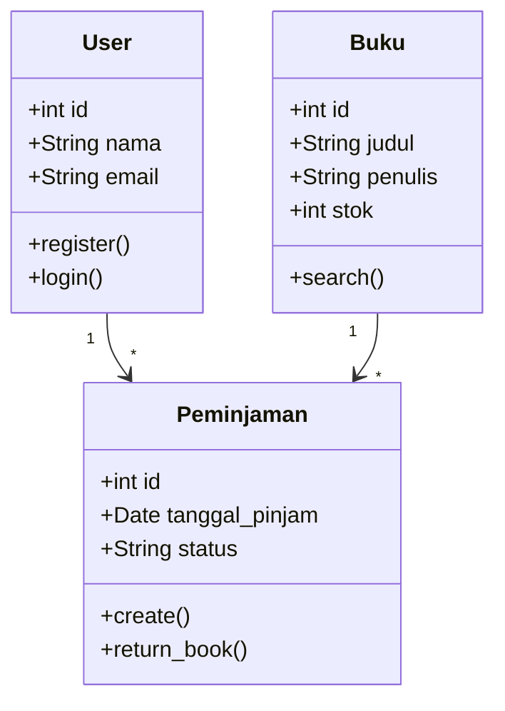
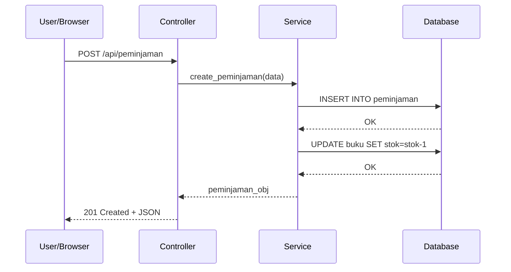

# Lab 06: UML Modeling dan Database Design

## Informasi Lab

| Komponen | Detail |
|----------|--------|
| **Mata Kuliah** | Rekayasa Perangkat Lunak (IF2205) |
| **Lab** | 6 dari 13 |
| **Topik** | Class Diagram, Sequence Diagram, ERD, SQLAlchemy |
| **CPMK** | CPMK-3 |
| **Durasi** | 100 menit |
| **Platform** | GitHub Codespaces |

## Tujuan

1. **Membuat** Class Diagram dan Sequence Diagram menggunakan Mermaid
2. **Merancang** ERD dan menormalisasi hingga 3NF
3. **Mengimplementasikan** model database dengan SQLAlchemy

## Langkah-langkah

### Langkah 1: Class Diagram dengan Mermaid (20 menit)
Buat file `docs/class-diagram.md`:


### Langkah 2: Sequence Diagram (15 menit)


### Langkah 3: ERD dan Normalisasi (20 menit)
Desain ERD untuk proyek tim (minimal 4 entitas). Periksa:
- **1NF:** Semua kolom atomik? ✓
- **2NF:** Semua non-key bergantung pada seluruh PK? ✓
- **3NF:** Tidak ada transitive dependency? ✓

### Langkah 4: Implementasi SQLAlchemy (25 menit)
```python
from flask_sqlalchemy import SQLAlchemy
db = SQLAlchemy()

class User(db.Model):
    id = db.Column(db.Integer, primary_key=True)
    nama = db.Column(db.String(100), nullable=False)
    email = db.Column(db.String(120), unique=True)
    peminjaman = db.relationship('Peminjaman', backref='user')

class Buku(db.Model):
    id = db.Column(db.Integer, primary_key=True)
    judul = db.Column(db.String(200), nullable=False)
    penulis = db.Column(db.String(100))
    stok = db.Column(db.Integer, default=0)

class Peminjaman(db.Model):
    id = db.Column(db.Integer, primary_key=True)
    user_id = db.Column(db.Integer, db.ForeignKey('user.id'))
    buku_id = db.Column(db.Integer, db.ForeignKey('buku.id'))
    tanggal_pinjam = db.Column(db.DateTime)
    status = db.Column(db.String(20), default='dipinjam')
```

### Langkah 5: REST API Endpoints (10 menit)
Dokumentasikan 5+ endpoints untuk proyek:

| Method | Endpoint | Deskripsi |
|--------|----------|-----------|
| GET | /api/buku | Daftar buku |
| POST | /api/buku | Tambah buku |
| GET | /api/buku/:id | Detail buku |
| POST | /api/peminjaman | Pinjam buku |
| PATCH | /api/peminjaman/:id/return | Kembalikan buku |

## Tantangan Tambahan

1. Tambahkan entitas Kategori dengan relasi many-to-many ke Buku
2. Buat Activity Diagram untuk alur peminjaman

## Checklist Penyelesaian

- [ ] Class Diagram (Mermaid) dengan 4+ class
- [ ] Sequence Diagram untuk 1 alur utama
- [ ] ERD normalized hingga 3NF
- [ ] SQLAlchemy models terimplementasi
- [ ] API endpoints terdokumentasi

---

*"Problem Solvers in Digital, Driven by Ethics and Islamic Values"* — Program Studi Informatika, Universitas Al Azhar Indonesia
