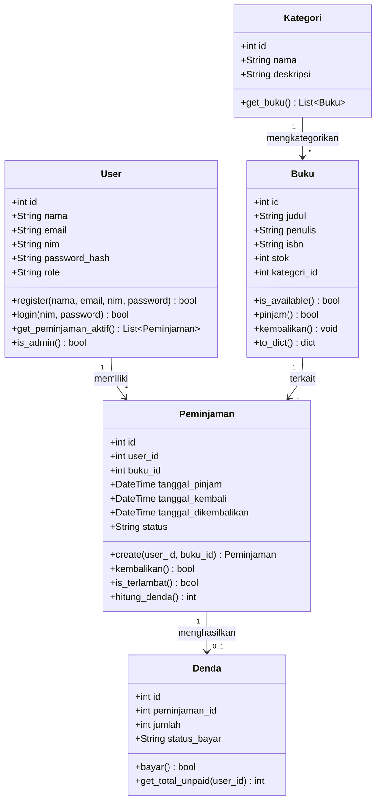
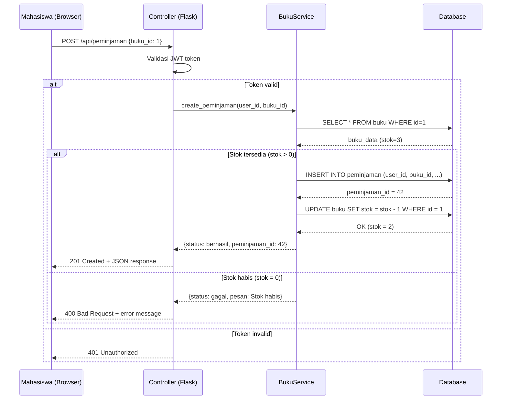
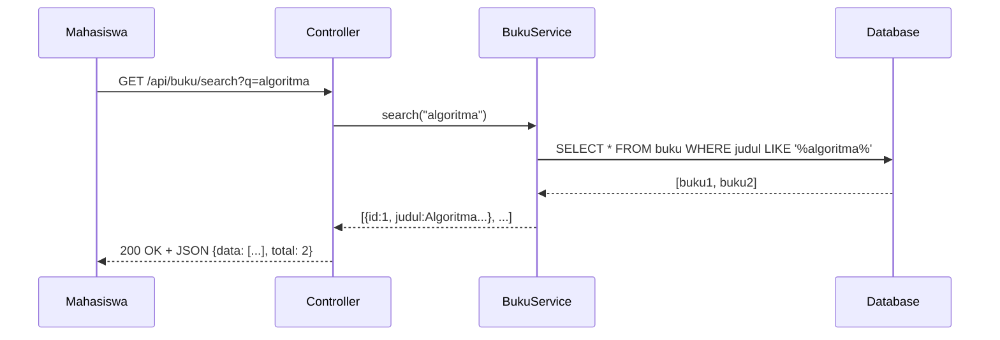
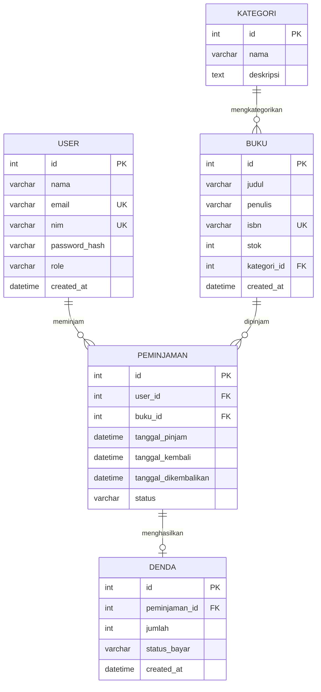

# Lab 06: UML Modeling dan Database Design

## Informasi Lab

| Komponen | Detail |
|----------|--------|
| **Mata Kuliah** | Rekayasa Perangkat Lunak (IF2205) |
| **Lab** | 6 dari 13 |
| **Topik** | Class Diagram, Sequence Diagram (Mermaid), ERD, Normalisasi, REST API Design |
| **CPMK** | CPMK-3 (Membuat diagram UML menggunakan PlantUML/Mermaid, merancang database dan REST API) |
| **Durasi** | 100 menit |
| **Platform** | GitHub Codespaces |
| **Prasyarat** | Lab 01-05 selesai, memahami konsep UML dan database design dari modul Minggu 6 |

---

## Tujuan

Setelah menyelesaikan lab ini, mahasiswa mampu:

1. **Membuat** (C6) Class Diagram yang merepresentasikan domain model proyek menggunakan Mermaid
2. **Membuat** (C6) Sequence Diagram untuk alur utama sistem
3. **Merancang** (C6) Entity Relationship Diagram (ERD) dan menormalisasi hingga 3NF
4. **Mendefinisikan** (C3) REST API endpoints yang konsisten dan terdokumentasi

---

## Konsep Singkat

### Mengapa UML Masih Relevan?

UML (Unified Modeling Language) adalah bahasa visual standar untuk memodelkan sistem perangkat lunak. Meskipun dunia Agile menekankan "working software over comprehensive documentation", diagram UML tetap penting untuk:

- **Komunikasi tim** -- satu diagram menjelaskan lebih baik dari 1000 kata
- **Design review** -- menemukan masalah desain sebelum coding
- **Onboarding** -- developer baru memahami sistem lebih cepat
- **Dokumentasi arsitektur** -- decision record yang visual

```
Kapan Menggunakan Diagram?

  "Just enough" UML -- Buat diagram yang berguna, bukan semua

  Class Diagram     -> Untuk desain domain model dan relasi
  Sequence Diagram  -> Untuk alur interaksi yang kompleks
  Activity Diagram  -> Untuk business process / workflow
  State Diagram     -> Untuk objek dengan banyak state
  ERD               -> Untuk desain database
```

### Mermaid: UML di Markdown

Mermaid adalah tool yang memungkinkan membuat diagram langsung di Markdown. GitHub mendukung rendering Mermaid secara native -- diagram langsung ditampilkan di README dan file `.md`.

### Normalisasi Database

Normalisasi memastikan data tidak duplikat dan konsisten:

| Normal Form | Aturan | Contoh Pelanggaran |
|-------------|--------|-------------------|
| **1NF** | Semua kolom atomik (tidak ada list) | telepon: "081234, 089876" |
| **2NF** | 1NF + semua non-key bergantung pada seluruh PK | Composite key tapi ada kolom yang hanya bergantung pada sebagian PK |
| **3NF** | 2NF + tidak ada transitive dependency | mahasiswa.nama_prodi padahal bisa didapat dari prodi.id |

### REST API Design

REST (Representational State Transfer) menggunakan HTTP methods untuk operasi CRUD:

| HTTP Method | Operasi | Contoh | Arti |
|------------|---------|--------|------|
| GET | Read | GET /api/buku | Ambil daftar buku |
| POST | Create | POST /api/buku | Tambah buku baru |
| PUT | Update (full) | PUT /api/buku/1 | Update semua field buku 1 |
| PATCH | Update (partial) | PATCH /api/buku/1 | Update beberapa field buku 1 |
| DELETE | Delete | DELETE /api/buku/1 | Hapus buku 1 |

> **Referensi:** Materi lengkap tersedia di modul Minggu 6 (week-06) dan Bab 6 Buku Ajar.

---

## Persiapan

| Kebutuhan | Detail |
|-----------|--------|
| Repository | Repository GitHub dari Lab 01-05 |
| Codespace | Aktif dengan extension Mermaid terinstall |
| Mermaid Preview | Extension bierner.markdown-mermaid di VS Code |
| Pengetahuan | Konsep OOP (class, inheritance, association) dan database dasar |

---

## Langkah-langkah

### Langkah 1: Identifikasi Domain Model (10 menit)

**Mengapa:** Sebelum menggambar diagram, kita harus mengidentifikasi entitas (class), atribut, method, dan relasi antar entitas. Ini adalah proses analisis yang mengubah requirements menjadi model.

**Instruksi:**

1. Buka SRS dari Lab 03 dan user stories dari Lab 04
2. Identifikasi entitas utama dan relasinya:

```markdown
## Domain Model Analysis

### Entitas Teridentifikasi

| Entitas | Atribut Utama | Relasi |
|---------|--------------|--------|
| User | id, nama, email, nim, password_hash, role | 1 User memiliki banyak Peminjaman |
| Buku | id, judul, penulis, isbn, stok, kategori_id | 1 Buku terkait banyak Peminjaman |
| Peminjaman | id, user_id, buku_id, tanggal_pinjam, status | many-to-1 User, many-to-1 Buku |
| Kategori | id, nama, deskripsi | 1 Kategori memiliki banyak Buku |
| Denda | id, peminjaman_id, jumlah, status_bayar | 1-to-1 Peminjaman |
```

3. Diskusikan: apakah ada entitas yang terlewat? Apakah relasinya sudah benar?

**Expected Output:** Tabel domain model yang akan menjadi dasar Class Diagram dan ERD.

**Estimasi waktu:** 10 menit

---

### Langkah 2: Buat Class Diagram dengan Mermaid (20 menit)

**Mengapa:** Class Diagram menunjukkan struktur statis sistem -- class apa saja yang ada, atribut dan method-nya, serta bagaimana mereka berelasi. Ini menjadi blueprint untuk implementasi kode.

**Instruksi:**

Buat file `docs/diagrams/class-diagram.md`. Berikut contoh Mermaid Class Diagram untuk proyek perpustakaan:



Tambahkan penjelasan relasi dalam dokumen:

```markdown
## Penjelasan Relasi

| Relasi | Kardinalitas | Penjelasan |
|--------|-------------|-----------|
| User -> Peminjaman | 1 : * | Satu user bisa memiliki banyak peminjaman |
| Buku -> Peminjaman | 1 : * | Satu buku bisa dipinjam berkali-kali |
| Kategori -> Buku | 1 : * | Satu kategori berisi banyak buku |
| Peminjaman -> Denda | 1 : 0..1 | Peminjaman bisa punya denda atau tidak |
```

Verifikasi diagram dengan membuka preview Markdown (klik ikon preview di VS Code atau push ke GitHub untuk melihat render).

**Expected Output:** Class diagram dengan 5 class, atribut, method, dan relasi yang benar.

**Estimasi waktu:** 20 menit

> **Troubleshooting:** Jika Mermaid tidak ter-render di VS Code, pastikan extension bierner.markdown-mermaid terinstall. Jika masih gagal, push ke GitHub -- GitHub mendukung Mermaid secara native.

---

### Langkah 3: Buat Sequence Diagram (15 menit)

**Mengapa:** Sequence Diagram menunjukkan interaksi antar objek secara kronologis untuk satu skenario tertentu. Ini sangat berguna untuk mendesain API dan memahami flow data.

**Instruksi:**

Buat file `docs/diagrams/sequence-diagram.md` dengan 2 sequence diagram.

**Diagram 1: Alur Peminjaman Buku**



**Diagram 2: Alur Pencarian Buku**



**Diskusi tim (5 menit):** Perhatikan sequence diagram peminjaman. Apa yang terjadi jika 2 mahasiswa mencoba meminjam buku yang sama secara bersamaan dan stok hanya tinggal 1? Ini disebut **race condition** -- bagaimana menanganinya?

**Expected Output:** 2 sequence diagram yang menunjukkan alur interaksi lengkap.

**Estimasi waktu:** 15 menit

---

### Langkah 4: Rancang ERD dan Normalisasi (20 menit)

**Mengapa:** ERD menerjemahkan Class Diagram menjadi struktur database relasional. Normalisasi memastikan data tidak redundan dan meminimalkan anomali saat insert, update, dan delete.

**Instruksi:**

1. Buat ERD menggunakan Mermaid (docs/diagrams/erd.md):



2. Lakukan checklist normalisasi:

```markdown
## Checklist Normalisasi

### 1NF (First Normal Form)
- [x] Semua kolom berisi nilai atomik (tidak ada array/list)
- [x] Setiap tabel memiliki Primary Key
- [x] Tidak ada repeating groups
  
  Contoh pelanggaran yang DIHINDARI:
  SALAH: BUKU.penulis = "Martin, Fowler" (multiple values)
  BENAR: Jika buku punya banyak penulis, buat tabel BUKU_PENULIS

### 2NF (Second Normal Form)  
- [x] Memenuhi 1NF
- [x] Semua atribut non-key bergantung pada SELURUH Primary Key
  
  Contoh pelanggaran yang DIHINDARI:
  SALAH: PEMINJAMAN(user_id, buku_id, user_nama, buku_judul)
  BENAR: Simpan user_nama di tabel USER, bukan di PEMINJAMAN

### 3NF (Third Normal Form)
- [x] Memenuhi 2NF
- [x] Tidak ada transitive dependency
  
  Contoh pelanggaran yang DIHINDARI:
  SALAH: BUKU(id, judul, kategori_id, kategori_nama)
  BENAR: Simpan kategori_nama di tabel KATEGORI
```

3. Diskusikan: apakah ada kebutuhan **denormalisasi** untuk performance? Contoh: menyimpan nama_peminjam di tabel PEMINJAMAN untuk menghindari JOIN saat menampilkan daftar.

**Expected Output:** ERD dengan 5 entitas yang sudah dinormalisasi hingga 3NF.

**Estimasi waktu:** 20 menit

> **Tips:** Denormalisasi bukan berarti salah -- kadang diperlukan untuk performance. Tapi selalu mulai dari bentuk normal, lalu denormalisasi dengan alasan yang jelas dan didokumentasikan.

---

### Langkah 5: Implementasi Model Database (15 menit)

**Mengapa:** Menerjemahkan ERD menjadi kode SQLAlchemy memvalidasi bahwa desain database bisa diimplementasikan. Ini juga menjadi foundation untuk proyek akhir.

**Instruksi:**

Buat file `app/models/database.py`:

```python
# app/models/database.py - SQLAlchemy models berdasarkan ERD

from flask_sqlalchemy import SQLAlchemy
from datetime import datetime, timedelta

db = SQLAlchemy()


class User(db.Model):
    """Model User - mahasiswa, pustakawan, atau admin."""
    __tablename__ = 'user'
    
    id = db.Column(db.Integer, primary_key=True)
    nama = db.Column(db.String(100), nullable=False)
    email = db.Column(db.String(120), unique=True, nullable=False)
    nim = db.Column(db.String(20), unique=True)
    password_hash = db.Column(db.String(256), nullable=False)
    role = db.Column(db.String(20), default='mahasiswa')
    created_at = db.Column(db.DateTime, default=datetime.utcnow)
    
    # Relasi
    peminjaman = db.relationship('Peminjaman', backref='user', lazy=True)
    
    def __repr__(self):
        return f'<User {self.nama} ({self.nim})>'


class Kategori(db.Model):
    """Model Kategori buku."""
    __tablename__ = 'kategori'
    
    id = db.Column(db.Integer, primary_key=True)
    nama = db.Column(db.String(50), nullable=False, unique=True)
    deskripsi = db.Column(db.Text)
    
    # Relasi
    buku_list = db.relationship('Buku', backref='kategori', lazy=True)
    
    def __repr__(self):
        return f'<Kategori {self.nama}>'


class Buku(db.Model):
    """Model Buku perpustakaan."""
    __tablename__ = 'buku'
    
    id = db.Column(db.Integer, primary_key=True)
    judul = db.Column(db.String(200), nullable=False)
    penulis = db.Column(db.String(100), nullable=False)
    isbn = db.Column(db.String(20), unique=True)
    stok = db.Column(db.Integer, default=0)
    kategori_id = db.Column(db.Integer, db.ForeignKey('kategori.id'))
    created_at = db.Column(db.DateTime, default=datetime.utcnow)
    
    # Relasi
    peminjaman = db.relationship('Peminjaman', backref='buku', lazy=True)
    
    def is_available(self):
        """Cek ketersediaan buku."""
        return self.stok > 0
    
    def __repr__(self):
        return f'<Buku {self.judul}>'


class Peminjaman(db.Model):
    """Model Peminjaman buku."""
    __tablename__ = 'peminjaman'
    
    id = db.Column(db.Integer, primary_key=True)
    user_id = db.Column(db.Integer, db.ForeignKey('user.id'), nullable=False)
    buku_id = db.Column(db.Integer, db.ForeignKey('buku.id'), nullable=False)
    tanggal_pinjam = db.Column(db.DateTime, default=datetime.utcnow)
    tanggal_kembali = db.Column(db.DateTime)  # Deadline
    tanggal_dikembalikan = db.Column(db.DateTime)  # Aktual
    status = db.Column(db.String(20), default='dipinjam')
    # status: dipinjam, dikembalikan, terlambat
    
    # Relasi
    denda = db.relationship('Denda', backref='peminjaman', uselist=False)
    
    def __init__(self, **kwargs):
        super().__init__(**kwargs)
        if not self.tanggal_kembali:
            # Default deadline: 14 hari dari tanggal pinjam
            self.tanggal_kembali = datetime.utcnow() + timedelta(days=14)
    
    def is_terlambat(self):
        """Cek apakah peminjaman terlambat."""
        if self.status == 'dikembalikan':
            return self.tanggal_dikembalikan > self.tanggal_kembali
        return datetime.utcnow() > self.tanggal_kembali
    
    def hitung_denda(self):
        """Hitung denda keterlambatan (Rp 1.000/hari)."""
        if not self.is_terlambat():
            return 0
        if self.tanggal_dikembalikan:
            delta = self.tanggal_dikembalikan - self.tanggal_kembali
        else:
            delta = datetime.utcnow() - self.tanggal_kembali
        return max(0, delta.days) * 1000  # Rp 1.000 per hari


class Denda(db.Model):
    """Model Denda keterlambatan."""
    __tablename__ = 'denda'
    
    id = db.Column(db.Integer, primary_key=True)
    peminjaman_id = db.Column(db.Integer, db.ForeignKey('peminjaman.id'), unique=True)
    jumlah = db.Column(db.Integer, nullable=False)
    status_bayar = db.Column(db.String(20), default='belum')  # belum, lunas
    created_at = db.Column(db.DateTime, default=datetime.utcnow)
```

Install dependency dan commit:

```bash
pip install flask-sqlalchemy
echo "flask-sqlalchemy==3.1.1" >> requirements.txt

git add app/models/database.py requirements.txt
git commit -m "feat: implementasi SQLAlchemy models berdasarkan ERD"
git push origin main
```

**Expected Output:** 5 model SQLAlchemy yang merepresentasikan ERD.

**Estimasi waktu:** 15 menit

> **Troubleshooting:** Jika ada error circular import, pastikan `db = SQLAlchemy()` didefinisikan di satu tempat dan di-import oleh model-model lain, bukan sebaliknya.

---

### Langkah 6: Dokumentasi REST API Endpoints (10 menit)

**Mengapa:** Dokumentasi API adalah "kontrak" antara frontend dan backend developer. Dengan dokumentasi yang jelas, frontend bisa mulai development menggunakan mock data sementara backend belum selesai.

**Instruksi:**

Buat file `docs/api-spec.md` dengan tabel endpoint berikut:

```markdown
# REST API Specification
## Sistem Perpustakaan Digital UAI

**Base URL:** /api
**Format:** JSON
**Authentication:** JWT Bearer Token (kecuali endpoint publik)

### Authentication

| Method | Endpoint | Auth? | Deskripsi |
|--------|----------|-------|-----------|
| POST | /api/auth/register | No | Registrasi user baru |
| POST | /api/auth/login | No | Login user |

### Buku

| Method | Endpoint | Auth? | Deskripsi |
|--------|----------|-------|-----------|
| GET | /api/buku | No | Daftar semua buku |
| GET | /api/buku/:id | No | Detail buku |
| GET | /api/buku/search?q=keyword | No | Pencarian buku |
| POST | /api/buku | Yes (admin) | Tambah buku baru |
| PUT | /api/buku/:id | Yes (admin) | Update buku |
| DELETE | /api/buku/:id | Yes (admin) | Hapus buku |

### Peminjaman

| Method | Endpoint | Auth? | Deskripsi |
|--------|----------|-------|-----------|
| GET | /api/peminjaman | Yes | Daftar peminjaman user |
| POST | /api/peminjaman | Yes | Pinjam buku |
| PATCH | /api/peminjaman/:id/return | Yes | Kembalikan buku |
| GET | /api/peminjaman/terlambat | Yes (admin) | Daftar terlambat |

### Kategori

| Method | Endpoint | Auth? | Deskripsi |
|--------|----------|-------|-----------|
| GET | /api/kategori | No | Daftar kategori |
| POST | /api/kategori | Yes (admin) | Tambah kategori |

### Error Response Format

| HTTP Code | Arti | Contoh |
|-----------|------|--------|
| 400 | Bad Request | Input tidak valid |
| 401 | Unauthorized | Token tidak ada/expired |
| 403 | Forbidden | Tidak punya akses |
| 404 | Not Found | Resource tidak ditemukan |
| 409 | Conflict | Data duplikat |
| 500 | Server Error | Error internal |
```

Commit semua dokumentasi:

```bash
git add docs/
git commit -m "docs: tambah class diagram, sequence diagram, ERD, dan API spec"
git push origin main
```

**Expected Output:** Dokumentasi API lengkap dengan method, endpoint, auth requirement.

**Estimasi waktu:** 10 menit

> **Diskusi kelas:** Mengapa kita menggunakan PATCH (bukan PUT) untuk mengembalikan buku? Apa perbedaan semantik antara PUT dan PATCH?

---

## Tantangan Tambahan

### Tantangan 1: Dasar
Tambahkan entitas Kategori dengan relasi **many-to-many** ke Buku (satu buku bisa punya banyak kategori, satu kategori berisi banyak buku). Buat tabel pivot `buku_kategori`. Update Class Diagram dan ERD.

### Tantangan 2: Menengah
Buat **Activity Diagram** menggunakan Mermaid untuk alur peminjaman buku dari awal (mahasiswa buka aplikasi) hingga akhir (buku berhasil dipinjam atau gagal). Sertakan decision node untuk setiap kondisi (login check, stok check, batas pinjam check).

### Tantangan 3: Lanjutan
Desain REST API yang mendukung **pagination**, **filtering**, dan **sorting**. Contoh: `GET /api/buku?page=2&per_page=10&sort=judul&order=asc&kategori=informatika`. Dokumentasikan format query parameter dan response yang mencakup metadata pagination (total_items, total_pages, current_page). Bandingkan dengan standar API perusahaan Indonesia (Tokopedia API, GoTo Financial API).

---

## Refleksi & AI Usage Log

Sebelum meninggalkan lab, isi refleksi berikut di file `docs/refleksi-lab-06.md`:

1. **Apa perbedaan antara Class Diagram dan ERD? Kapan menggunakan masing-masing?**
2. **Mengapa normalisasi penting? Kapan denormalisasi dibenarkan?**
3. **Apa tantangan dalam mendesain REST API yang konsisten?**
4. **Bagaimana diagram membantu komunikasi dalam tim?**

Jika menggunakan AI selama lab, catat di **AI Usage Log**:

| Prompt yang Diberikan | Output AI | Modifikasi yang Dilakukan | Refleksi |
|----------------------|-----------|--------------------------|----------|
| (contoh prompt) | (ringkasan output) | (apa yang diubah) | (apa yang dipelajari) |

---

## Checklist Penyelesaian

- [ ] Domain model teridentifikasi (5 entitas, atribut, relasi)
- [ ] Class Diagram (Mermaid) dengan 5 class, atribut, method, dan relasi
- [ ] Sequence Diagram untuk 2 alur utama (peminjaman dan pencarian)
- [ ] ERD (Mermaid) dengan 5 entitas, PK, FK, dan kardinalitas
- [ ] Checklist normalisasi 1NF, 2NF, 3NF terisi dengan contoh
- [ ] SQLAlchemy models terimplementasi di `app/models/database.py`
- [ ] REST API documentation lengkap di `docs/api-spec.md` (minimal 12 endpoints)
- [ ] Semua diagram tersimpan di `docs/diagrams/` dan di-commit
- [ ] File refleksi `docs/refleksi-lab-06.md` terisi

---

*"Problem Solvers in Digital, Driven by Ethics and Islamic Values"* — Program Studi Informatika, Universitas Al Azhar Indonesia
