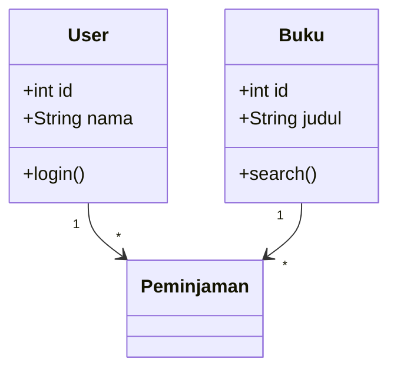

# LAMPIRAN

---

## Lampiran A: Setup GitHub Codespaces

### A.1 Membuat GitHub Account
1. Buka [github.com](https://github.com) dan klik "Sign up"
2. Gunakan email kampus untuk mendapatkan GitHub Education benefits
3. Verifikasi email dan lengkapi profil

### A.2 Membuat Repository
1. Klik "New repository"
2. Nama: `sistem-perpustakaan` (atau sesuai proyek)
3. Pilih "Private" untuk proyek kuliah
4. Centang "Add a README file"
5. Pilih `.gitignore` template: Python
6. Klik "Create repository"

### A.3 Membuka Codespace
1. Di repository, klik tombol hijau "Code"
2. Pilih tab "Codespaces"
3. Klik "Create codespace on main"
4. Tunggu environment siap (~1-2 menit)

### A.4 Konfigurasi Environment
```bash
# Install Python dependencies
pip install flask flask-sqlalchemy pytest pytest-cov flake8

# Install Node.js (jika perlu)
nvm install 18
npm install

# Verify
python --version
node --version
git --version
```

### A.5 Extensions yang Direkomendasikan
- Python (Microsoft)
- Prettier - Code formatter
- GitLens
- REST Client (Thunder Client)
- Markdown Preview Enhanced

---

## Lampiran B: Git Cheat Sheet

### B.1 Konfigurasi Awal
```bash
git config --global user.name "Nama Anda"
git config --global user.email "email@uai.ac.id"
```

### B.2 Operasi Dasar
| Perintah | Fungsi |
|----------|--------|
| `git init` | Inisialisasi repository baru |
| `git clone <url>` | Clone repository dari remote |
| `git status` | Lihat status perubahan |
| `git add <file>` | Stage file untuk commit |
| `git add .` | Stage semua perubahan |
| `git commit -m "pesan"` | Commit perubahan |
| `git push` | Push ke remote |
| `git pull` | Pull dari remote |
| `git log --oneline` | Lihat history singkat |

### B.3 Branching
| Perintah | Fungsi |
|----------|--------|
| `git branch` | Lihat daftar branch |
| `git branch <nama>` | Buat branch baru |
| `git checkout <branch>` | Pindah ke branch |
| `git checkout -b <nama>` | Buat dan pindah ke branch baru |
| `git merge <branch>` | Merge branch ke branch aktif |
| `git branch -d <nama>` | Hapus branch (sudah merged) |

### B.4 Remote
| Perintah | Fungsi |
|----------|--------|
| `git remote -v` | Lihat remote URLs |
| `git fetch origin` | Fetch perubahan dari remote |
| `git push -u origin <branch>` | Push branch baru ke remote |
| `git pull origin <branch>` | Pull specific branch |

### B.5 Undo / Fix
| Perintah | Fungsi |
|----------|--------|
| `git stash` | Simpan perubahan sementara |
| `git stash pop` | Kembalikan stash |
| `git checkout -- <file>` | Buang perubahan di file |
| `git reset HEAD <file>` | Unstage file |
| `git revert <commit>` | Buat commit yang membatalkan commit lain |

---

## Lampiran C: Template AI Usage Log

### Format Tabel

| No | Tanggal | Task/Aktivitas | Tool AI | Prompt yang Digunakan | Output AI (Ringkasan) | Evaluasi (Benar/Salah/Perlu Modifikasi) | Modifikasi yang Dilakukan | Waktu Tanpa AI (estimasi) | Waktu Dengan AI |
|----|---------|----------------|---------|----------------------|----------------------|----------------------------------------|--------------------------|--------------------------|-----------------|
| 1 | | | | | | | | | |
| 2 | | | | | | | | | |

### Contoh Pengisian

| No | Tanggal | Task | Tool | Prompt | Output | Evaluasi | Modifikasi | Tanpa AI | Dengan AI |
|----|---------|------|------|--------|--------|----------|------------|----------|-----------|
| 1 | 2026-03-15 | Buat unit test | Claude | "Buatkan pytest untuk class BukuService" | 5 test functions | 4/5 benar | Fix assertion test_stok_kosong | 45 min | 15 min |
| 2 | 2026-03-16 | Refactor route | Copilot | Autocomplete | Extract method | Sesuai | Minor rename | 20 min | 5 min |

### Panduan Pengisian
1. **Isi setiap kali menggunakan AI** untuk tugas akademik
2. **Jujur** — catat juga ketika AI memberikan output yang salah
3. **Evaluasi kritis** — jangan hanya "Benar" tanpa verifikasi
4. **Submit** bersama tugas/laporan yang relevan

---

## Lampiran D: Template SRS (IEEE 830)

```markdown
# Software Requirements Specification (SRS)
## [Nama Sistem]

### 1. Pendahuluan

#### 1.1 Tujuan
[Tujuan dokumen SRS ini]

#### 1.2 Ruang Lingkup
[Nama software, apa yang dilakukan dan tidak dilakukan]

#### 1.3 Definisi, Akronim, dan Singkatan
| Istilah | Definisi |
|---------|----------|
| [istilah] | [definisi] |

#### 1.4 Referensi
[Dokumen yang direferensikan]

#### 1.5 Overview Dokumen
[Ringkasan struktur dokumen ini]

### 2. Deskripsi Umum

#### 2.1 Perspektif Produk
[Hubungan dengan sistem lain, konteks]

#### 2.2 Fungsi Produk
[Ringkasan fungsi utama]

#### 2.3 Karakteristik Pengguna
| Pengguna | Deskripsi | Kebutuhan |
|----------|-----------|-----------|
| [role] | [deskripsi] | [kebutuhan] |

#### 2.4 Batasan
[Batasan teknis, regulasi, dll]

#### 2.5 Asumsi dan Dependensi
[Asumsi yang dibuat]

### 3. Kebutuhan Spesifik

#### 3.1 Functional Requirements
| ID | Deskripsi | Prioritas |
|----|-----------|-----------|
| FR-01 | [deskripsi] | Must |
| FR-02 | [deskripsi] | Must |

#### 3.2 Non-Functional Requirements
| ID | Kategori | Deskripsi | Metrik |
|----|----------|-----------|--------|
| NFR-01 | Performance | [deskripsi] | [metrik] |

#### 3.3 External Interface Requirements
##### 3.3.1 User Interface
[Deskripsi antarmuka pengguna]

##### 3.3.2 API Interface
[Deskripsi API endpoints]
```

---

## Lampiran E: UML Cheat Sheet

### E.1 Class Diagram Notations
```
┌──────────────────┐
│    ClassName      │  ← Nama class (PascalCase)
├──────────────────┤
│ - privateAttr     │  ← Atribut (- private, + public, # protected)
│ + publicAttr      │
├──────────────────┤
│ + publicMethod()  │  ← Method
│ - privateMethod() │
└──────────────────┘

Relasi:
───────  Association (uses)
◇──────  Aggregation (has-a, bisa terpisah)
◆──────  Composition (has-a, tidak bisa terpisah)
△──────  Inheritance (is-a)
- - - ▶  Dependency (uses temporarily)

Multiplicity: 1, 0..1, *, 0..*, 1..*
```

### E.2 Sequence Diagram Notations
```
  Object1        Object2
    │                │
    │── message() ──▶│       Synchronous message
    │◀── return ─────│       Return
    │- - message - -▶│       Asynchronous message
    │                │
    ┌─┐              │       Activation bar
    │ │              │
    └─┘              │
```

### E.3 Activity Diagram Notations
```
(●)  Start node
(◉)  End node
[Action]  Activity/action
◇    Decision node
═══  Fork/join bar
```

### E.4 Mermaid Syntax (untuk README/docs)


---

## Lampiran F: Glosarium RPL

| Istilah (English) | Istilah (Indonesia) | Definisi |
|-------------------|---------------------|----------|
| Acceptance Criteria | Kriteria Penerimaan | Kondisi yang harus dipenuhi agar user story dianggap selesai |
| Acceptance Testing | Pengujian Penerimaan | Testing oleh stakeholder untuk memvalidasi requirements |
| Agile | Agile | Pendekatan iteratif dan inkremental dalam pengembangan software |
| API (Application Programming Interface) | Antarmuka Pemrograman Aplikasi | Kontrak antara komponen software untuk berkomunikasi |
| Architecture | Arsitektur | Struktur fundamental sistem software |
| Backlog | Backlog | Daftar prioritas semua yang dibutuhkan produk |
| Branch | Cabang | Alur pengembangan paralel dalam version control |
| CI/CD | CI/CD | Continuous Integration / Continuous Delivery — otomasi build, test, deploy |
| Clean Code | Kode Bersih | Kode yang mudah dibaca, dipahami, dan diubah |
| Code Review | Tinjauan Kode | Pemeriksaan kode oleh rekan untuk menemukan masalah |
| Code Smell | Bau Kode | Indikasi adanya masalah desain dalam kode |
| Container | Kontainer | Unit software terisolasi yang berisi kode dan dependensinya |
| CRUD | CRUD | Create, Read, Update, Delete — operasi dasar data |
| Deployment | Penerapan | Proses memasang software ke lingkungan produksi |
| Design Pattern | Pola Desain | Solusi terbukti untuk masalah desain yang umum |
| DevOps | DevOps | Kultur dan praktik yang menyatukan Development dan Operations |
| Docker | Docker | Platform containerization |
| Elicitation | Elisitasi | Proses mengumpulkan kebutuhan dari stakeholder |
| End-to-End (E2E) | Ujung ke Ujung | Testing yang menguji alur lengkap dari perspektif pengguna |
| ERD | ERD | Entity-Relationship Diagram — model database |
| Factory Pattern | Pola Factory | Design pattern untuk membuat objek tanpa menentukan class-nya |
| Functional Requirement | Kebutuhan Fungsional | Apa yang sistem harus lakukan |
| Git | Git | Sistem version control terdistribusi |
| GitHub Actions | GitHub Actions | Platform CI/CD terintegrasi di GitHub |
| Integration Testing | Pengujian Integrasi | Testing interaksi antar komponen |
| Iteration | Iterasi | Satu siklus pengembangan dalam model iteratif |
| Maintenance | Pemeliharaan | Proses memelihara dan mengevolusi software setelah deployment |
| Microservices | Layanan Mikro | Arsitektur di mana aplikasi terdiri dari layanan kecil independen |
| MoSCoW | MoSCoW | Teknik prioritisasi: Must, Should, Could, Won't |
| MVP (Minimum Viable Product) | Produk Minimum Layak | Versi produk dengan fitur minimal untuk validasi |
| Non-Functional Requirement | Kebutuhan Non-Fungsional | Bagaimana sistem harus bekerja (performa, keamanan, dll.) |
| Observer Pattern | Pola Observer | Design pattern di mana objek diberitahu saat state berubah |
| ORM | ORM | Object-Relational Mapping — memetakan objek ke database |
| Product Owner | Pemilik Produk | Role Scrum yang mengelola backlog |
| Pull Request (PR) | Pull Request | Permintaan untuk merge kode dari satu branch ke branch lain |
| Refactoring | Refaktorisasi | Mengubah struktur internal tanpa mengubah perilaku eksternal |
| Repository | Repositori | Tempat penyimpanan kode dan histori perubahannya |
| REST API | REST API | Architectural style untuk web API menggunakan HTTP methods |
| Scrum | Scrum | Framework Agile untuk mengelola pengembangan produk |
| Scrum Master | Scrum Master | Role Scrum yang memfasilitasi proses |
| SemVer | SemVer | Semantic Versioning — format MAJOR.MINOR.PATCH |
| Singleton Pattern | Pola Singleton | Design pattern yang memastikan hanya ada satu instance |
| SOLID | SOLID | 5 prinsip desain OOP: SRP, OCP, LSP, ISP, DIP |
| Sprint | Sprint | Iterasi timeboxed dalam Scrum (2-4 minggu) |
| SRS | SRS | Software Requirements Specification — dokumen kebutuhan |
| Strategy Pattern | Pola Strategy | Design pattern untuk memilih algoritma pada runtime |
| SWEBOK | SWEBOK | Software Engineering Body of Knowledge |
| TDD | TDD | Test-Driven Development — tulis test sebelum kode |
| Technical Debt | Hutang Teknis | "Hutang" dari shortcut development yang perlu "dibayar" |
| UML | UML | Unified Modeling Language — bahasa pemodelan standar |
| Unit Testing | Pengujian Unit | Testing fungsi/method individual |
| Use Case | Kasus Penggunaan | Deskripsi interaksi actor dengan sistem |
| User Story | Cerita Pengguna | Deskripsi fitur dari perspektif pengguna |
| Velocity | Kecepatan | Jumlah story points yang diselesaikan per sprint |
| Version Control | Kontrol Versi | Sistem untuk mengelola perubahan kode |
| Waterfall | Air Terjun | Model pengembangan sekuensial fase per fase |

---

## Lampiran G: Referensi Dataset Indonesia

### G.1 Data Pemerintah
| Sumber | URL | Jenis Data |
|--------|-----|-----------|
| BPS (Badan Pusat Statistik) | bps.go.id | Data demografis, ekonomi |
| data.go.id | data.go.id | Open data pemerintah |
| Jakarta Open Data | data.jakarta.go.id | Data khusus DKI Jakarta |

### G.2 Dataset untuk Proyek Kuliah
| Proyek | Data yang Diperlukan | Sumber |
|--------|---------------------|--------|
| Perpustakaan | Katalog buku, data peminjaman | Generate sendiri / Open Library API |
| UMKM | Data produk, transaksi | Generate sendiri |
| Antrian Puskesmas | Data pasien (mock), jadwal dokter | Generate sendiri |
| E-Commerce | Produk, kategori, reviews | Generate sendiri / Tokopedia public API |
| Zakat | Data muzakki, mustahik, distribusi | Generate sendiri |

### G.3 Seed Data Script
```python
# seed_data.py — Generate data contoh
import random
from faker import Faker

fake = Faker('id_ID')  # Faker untuk data Indonesia

def seed_users(db, n=50):
    for _ in range(n):
        user = User(
            nama=fake.name(),
            email=fake.email(),
            nim=f"2025{random.randint(10000, 99999)}"
        )
        db.session.add(user)
    db.session.commit()

def seed_buku(db, n=100):
    kategori = ['Algoritma', 'Database', 'Jaringan', 'AI', 'Web', 'Mobile']
    for _ in range(n):
        buku = Buku(
            judul=f"{fake.catch_phrase()} {random.choice(kategori)}",
            penulis=fake.name(),
            isbn=fake.isbn13(),
            stok=random.randint(1, 10)
        )
        db.session.add(buku)
    db.session.commit()
```

---

## Lampiran H: Panduan AI Bertanggung Jawab

### H.1 Prinsip Utama

1. **Transparansi**: Selalu dokumentasikan penggunaan AI (AI Usage Log)
2. **Verifikasi**: Jangan percaya output AI tanpa verifikasi
3. **Pemahaman**: Jangan submit kode yang tidak Anda pahami
4. **Atribusi**: Jangan klaim AI output sebagai karya original
5. **Batasan**: Kenali kapan AI tidak cocok digunakan

### H.2 Kapan Boleh Menggunakan AI

| Situasi | AI Diizinkan? | Catatan |
|---------|---------------|---------|
| Tugas mingguan | ✅ Ya | Wajib AI Usage Log |
| Proyek akhir | ✅ Ya | AI sebagai partner, wajib Log |
| Lab / praktikum | ✅ Ya | Wajib AI Usage Log |
| Kuis | ❌ Tidak | Closed-book, tanpa AI |
| UTS / UAS | ❌ Tidak | Closed-book, tanpa AI |
| Responsi praktikum | ❌ Tidak | Live coding tanpa AI |

### H.3 Red Flags — Penggunaan AI yang Tidak Bertanggung Jawab

- ❌ Copy-paste output AI tanpa membaca
- ❌ Submit kode AI tanpa testing
- ❌ Tidak mengisi AI Usage Log (academic dishonesty)
- ❌ Menggunakan AI saat ujian/kuis
- ❌ Klaim bahwa kode AI adalah karya sendiri tanpa modifikasi

### H.4 Best Practices

- ✅ Gunakan AI untuk **belajar konsep** — minta penjelasan, bukan jawaban
- ✅ **Iterasi** dengan AI — berikan feedback untuk improve output
- ✅ **Modifikasi** output AI sesuai konteks proyek Anda
- ✅ **Test** semua kode yang di-generate AI sebelum commit
- ✅ **Refleksi** — apa yang Anda pelajari dari interaksi dengan AI?

### H.5 Perspektif Islam

> *"Sesungguhnya Allah menyukai jika seseorang melakukan suatu pekerjaan, ia melakukannya dengan itqan (sempurna/profesional)."* — HR. Thabrani

AI adalah tool untuk membantu kita mencapai **itqan** — bukan untuk menghindari usaha. Gunakan AI dengan niat belajar dan menghasilkan karya terbaik.

---

*"Problem Solvers in Digital, Driven by Ethics and Islamic Values"* — Program Studi Informatika, Universitas Al Azhar Indonesia
